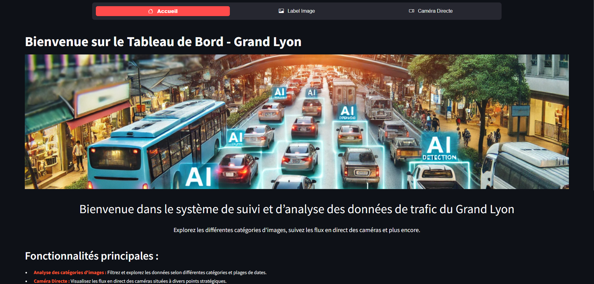

# Installation du Projet

Ce fichier README fournit des instructions sur la façon d'installer et de démarrer le projet.

## Prérequis

Avant de commencer, assurez-vous d'avoir les éléments suivants installés sur votre système :

- [Conda](https://www.anaconda.com/download/success) (Download Anaconda)

## Étapes d'Installation

1. **Créer un environnement virtuel :**  

    <span style="color:red; font-size:larger;">⚠️ Important ! Veuillez ouvrir le terminal Conda et exécuter les commandes ci-dessous : ⚠️</span>  

    ```bash
    conda create --name IA_Projet python=3.11 -y
    conda activate IA_Projet
    ```

2. **Cloner le projet depuis le dépôt Git :**
    ```bash 
    # Étape 1 :
    cd CheminDuProjetSouhaitez

    # Exemple : 
    cd C:\Users\labonde\Documents\Cours_CESI\

    # Étape 2 :
    git clone LienDuProjet

    # Étape 3 :
    cd IA_Projet
    ```

3. **Installer les dépendances Python :**

    ```bash
    # Étape 4 : Via le terminal du projet
    pip install -rf requirements.txt
    ```

4. **Ouvrir directement vers la direction du code :**

    ```bash
    # Étape 5 : Pour ouvrir le projet
    code .
    ```

5. **Créer un fichier `.env` :**

    Créez un fichier `.env` à la racine du projet et ajoutez les variables d'environnement nécessaires. Vous avez pour exemple le fichier .env_exemple.

    ```plaintext
    IMAGE_URL=url_de_l'image
    ```
    Remplacez `url_de_l'image` par l'URL de l'image.

6. **Téléchargement du modèle**
   Le modèle est bien trop volumieux pour entrer dans GITHUB, veuillez le télécharger le mettre dans le dossier src\models !
   [Le lien du modèle YOLOV5]([https://download.data.grandlyon.com/files/rdata/pvo_patrimoine_voirie.pvocameracriter/CWL9018.JPG](https://github.com/ultralytics/assets/releases/download/v8.2.0/yolov5x6u.pt))
   
## Utilisation

Une fois l'installation terminée, vous pouvez utiliser les script Python pour effectuer différentes opérations. Voici les utilisations possibles :

- **Lancement des images en temps réel :**

    ```bash
    # Premier Terminal 
    python .\main.py
    ```
    Cela extraira les images de l'URL spécifiée et les sauvegardera dans le répertoire `images`.

- **Lancement de l'interface web (streamlit)**
    ```bash
    # Deuxième Terminal
    streamlit run .\interface.py
    ```
- **L'interface que vous devriez utiliser.**


## Remarque

- Assurez-vous d'avoir configuré les variables d'environnement nécessaires dans le fichier `.env` avant d'exécuter le script. 
- IMAGE_URL cela doit-être URL de l'image du Grand Lyon, raccourci avec 
[ce lien](https://download.data.grandlyon.com/files/rdata/pvo_patrimoine_voirie.pvocameracriter/CWL9018.JPG)
- Si vous avez ajouté des importations dans votre code, vous pouvez régénérer le requirements.
    ```bash
    Génere le fichier requirements.txt 

    pip freeze > requirements.txt 
    ```
- Ne vous inquiétez pas, les dossiers contenant les images se créent automatiquement.

## Ce qu'il nous reste à faire
- Relabelliser nos images pour qu'elles correspondent aux classes de YOLO, afin d'obtenir une matrice de confusion correcte (par exemple, les vélos et les piétons ensemble).
- Télécharger automatiquement mon modèle
---
